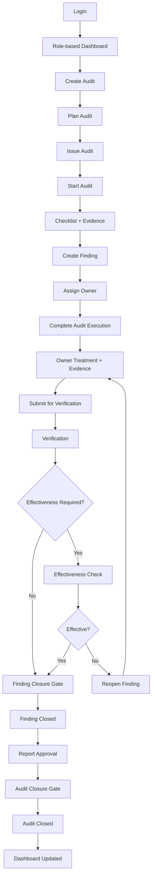

# SCREENS_FLOW_FINAL.md

## אפיון מסכים, מסע משתמש ומעברי מצב — MVP מערכת ניהול מבדקים

**תאריך:** 19.09.2026  
**סטטוס:** Final UX/Product Specification for MVP  
**בסיס מאושר למסמך:**  
- `PRODUCT_ANALYSIS.md`
- `TARGET_AUDIENCE.md`
- `DESIGN_SYSTEM.md`

> המסמך מגדיר את מסלול המשתמש מקצה לקצה, את ארבעת מסכי הליבה, את מצבי הממשק, שערי הסגירה, הרשאות, חריגים, מדידה ומסירה ל-Figma.  
> הוא אינו מחליף `COMPONENT_SPEC.md` ואינו קובע פרטי מימוש Frontend שאינם נחוצים להבנת המוצר.

---

# 0. מקרא החלטות ומקורות

| סימון | משמעות |
|---|---|
| `[PA]` | נגזר מ-`PRODUCT_ANALYSIS.md` |
| `[TA]` | נגזר מ-`TARGET_AUDIENCE.md` |
| `[DS]` | נגזר מ-`DESIGN_SYSTEM.md` |
| `[PROPOSED]` | החלטת UX/Product מומלצת למסמך זה, נדרשת לאישור |
| `[OPEN]` | החלטה שטרם הוכרעה |
| `[CONFIG]` | התנהגות שמומלץ לאפשר כקונפיגורציה ולא לקבע בקוד |

---

# PART A — FLOW FOUNDATIONS

# 1. מטרת ה-MVP

ה-MVP צריך להוכיח Closed Loop מלא:

```text
Login
→ Audit Programme
→ Audit Planning
→ Audit Execution
→ Finding
→ Corrective Action
→ Implementation Evidence
→ Verification
→ Effectiveness Check, if required
→ Finding Closure
→ Report Approval
→ Audit Closure
→ Updated Dashboard
```

הערך העסקי המרכזי הוא לא מספר המסכים, אלא היכולת להשלים את התהליך במערכת אחת, עם Traceability מלאה ובלי תלות ב-Word/Excel מקביל. `[PA][TA]`

---

# 2. פרסונות P0

המסלול נבנה עבור ארבע פרסונות ליבה: `[TA]`

1. **Audit Programme Manager**
2. **Lead Auditor**
3. **Finding / Action Owner**
4. **Verifier / Closure Approver**

פרסונות משניות:

- Auditor
- Auditee Representative
- Unit / Supplier / Project Manager
- Viewer

---

# 3. החלטות תכנון מרכזיות

| ID | החלטה | סטטוס |
|---|---|---|
| `D1` | ארבעה מסכי Core: Access, Role-based Dashboard, Audit Workspace, Finding Workspace | `[PROPOSED]` |
| `D2` | אין Self-Signup ציבורי כברירת מחדל; כניסה ארגונית/מוזמנת | `[PROPOSED]` |
| `D3` | מסך בית אחד עם וריאציות לפי Role | `[PROPOSED]` |
| `D4` | יצירת Audit מתחילה ב-Audit Workspace במצב Draft | `[PROPOSED]` |
| `D5` | Audit Workspace מכיל 5 Tabs בלבד ב-MVP | `[PROPOSED]` |
| `D6` | Verifier הוא Role לוגי נפרד, גם אם אדם אחד מחזיק כמה Roles | `[PA][TA]` |
| `D7` | פעולה חסומה על אובייקט גלוי מוצגת עם הסבר; אובייקט לא מורשה אינו נחשף | `[PA][DS]` |
| `D8` | Green is earned: ירוק רק לתוצאה מאומתת/סופית | `[DS]` |
| `D9` | כפתורים משתמשים בפועל ברור: "שלח", "התחל", "אשר", "סגור" | `[DS]` |
| `D10` | Root Cause, Effectiveness וסוגי תשובה לשאלון אינם מקובעים גלובלית | `[OPEN][CONFIG]` |
| `D11` | Overdue הוא שכבה על Status, לא Status נוסף | `[DS]` |

---

# 4. Global Page FSM

לכל מסך Core קיימים ארבעה מצבים בסיסיים:

```text
Loading
Success
Error
Empty
```

ומצבי משנה תפעוליים:

```text
Refreshing
Saving
Forbidden
Conflict
```

## 4.1 משמעות

| State | משמעות |
|---|---|
| `Loading` | מידע טרם התקבל או פעולה משמעותית עדיין בעיבוד |
| `Success` | המידע תקין והפעולות המותרות זמינות |
| `Error` | כשל טעינה, ולידציה או פעולה |
| `Empty` | אין תוכן להצגה בהקשר הנתון |
| `Refreshing` | נתונים קיימים מוצגים תוך רענון |
| `Saving` | שינוי נשלח לשמירה |
| `Forbidden` | הפעולה/האובייקט אינם זמינים למשתמש |
| `Conflict` | קיימת גרסה חדשה יותר או שינוי מקביל |

---

# 5. Action FSM

כל פעולה אסינכרונית מהותית פועלת כך:

```text
Idle
→ Loading
→ Success | Error
```

חל על:

- Save
- Upload
- Submit
- Approve
- Reject
- Close
- Reopen
- Export

### Guardrail

מעברי Lifecycle, Closure ו-Reopen אינם מקבלים עדכון סופי לפני אישור שרת.

---

# 6. Guardrails חוצי-מערכת

1. **אין Silent Failure** — כל כשל מקבל Feedback.
2. **אין איבוד קלט** — תוכן שהמשתמש הזין נשמר במסך לאחר שגיאה שניתנת להתאוששות.
3. **אין חסם נסתר** — Closure Blocker מוצג במפורש.
4. **אין פעולה הרסנית אוטומטית** — Cancel / Delete / Reopen דורשים Confirmation; Reopen דורש Reason.
5. **פעולה ראשית אחת לאזור**.
6. **Status ≠ Severity ≠ Time** — מוצגים בנפרד.
7. **Green is earned**.
8. **הרשאה היא חלק מה-UX**.
9. **RTL-first**.
10. **Audit Trail קריא לאדם**.
11. **Deep Link שומר Context** אחרי Authentication.
12. **מידע מסווג/רגיש** לא נחשף בהתראה חיצונית מעבר למה שמדיניות הארגון מאפשרת. `[OPEN]`

---

# PART B — END-TO-END FLOW

# 7. Happy Path — מבט על



---

# 8. Happy Path — טבלת צעדים

| # | Actor | Screen | User Action | System Response | State After | Trigger |
|---|---|---|---|---|---|---|
| 1 | Programme Manager | S1 → S2 | כניסה | Authentication + Role load | Dashboard | — |
| 2 | Programme Manager | S2 → S3 | `צור מבדק` | Audit חדש נפתח | Draft | — |
| 3 | Programme Manager | S3 | מגדיר Type, Auditee, Scope, Criteria, Lead, Date | Validation + Save | Planned | — |
| 4 | Programme Manager | S3 | `הוצא מבדק` | בסיס תכנוני ננעל לפי הכללים | Issued | התראה ל-Lead |
| 5 | Lead Auditor | S3 | `התחל מבדק` | Workspace עובר לביצוע | In Progress | — |
| 6 | Lead Auditor | S3 | תשובות + Evidence | Evidence מקושר ל-Criterion | In Progress | — |
| 7 | Lead Auditor | S3 | `פתח ממצא` | Criterion/Evidence מקושרים, Owner + Due Date | Finding Open | התראה ל-Owner |
| 8 | Lead Auditor | S3 | `סיים ביצוע` | Draft Report נבנה מהנתונים | Audit Completed | טיפול Findings |
| 9 | Finding Owner | S1 → S4 | פתיחת Deep Link | Login אם נדרש → Finding | Open | — |
| 10 | Finding Owner | S4 | Correction / RCA אם נדרש / Action / Evidence | טיוטה נשמרת | In Treatment | — |
| 11 | Finding Owner | S4 | `שלח לאימות` | Validation + Notification | Pending Verification | Verifier |
| 12 | Verifier | S2 → S4 | פותח פריט מתור אימות | Context + Evidence + Decision | Pending Verification | — |
| 13 | Verifier | S4 | `אשר אימות` | Verification נרשם | Branch | Effectiveness rule |
| 14A | Verifier | S4 | אין Effectiveness נדרש | Closure Gate נבדק | Ready to Close | — |
| 14B | Verifier | S4 | Effectiveness נדרש | תאריך/שיטה/בדיקה | Pending Effectiveness | — |
| 15 | Verifier | S4 | `אשר אפקטיביות` / `לא אפקטיבי` | Effective → Gate; Not Effective → Reopen | Effective / Reopened | — |
| 16 | Verifier / Approver | S4 | `סגור ממצא` | Finding Gate נבדק | Closed | — |
| 17 | Closure Approver | S3 | `אשר דוח` | Report Approved | Completed | — |
| 18 | Closure Approver | S3 | `סגור מבדק` | Audit Gate נבדק | Closed | Dashboard |
| 19 | Programme Manager | S2 | רואה את הלוח | KPI / Status מתעדכנים | Value Delivered | — |

---

# 9. רגעי ערך לפי Persona

| Persona | Moment of Value |
|---|---|
| Programme Manager | מבין תוך פחות מדקה מה דורש טיפול |
| Lead Auditor | מבצע Audit ומפיק Report בלי קובץ מקביל |
| Finding Owner | יודע מה נדרש ממנו ומה חסר לסגירה |
| Verifier | יכול לשחזר מי אישר, על סמך איזה Evidence ומתי |

---

# 10. Exception Flows

## 10.1 Evidence Rejected

```text
Verifier
→ Reject
→ Mandatory Reason
→ Finding returns to treatment
→ Owner notified
→ Update
→ Resubmit
```

## 10.2 Overdue

```text
Due Soon
→ Reminder
→ Due Date passed
→ Overdue flag
→ Escalation according to configured rule
```

## 10.3 Extension

```text
Owner requests extension
→ Reason
→ Authorized reviewer
→ Approve / Reject
→ Due Date + History updated
```

## 10.4 Effectiveness Failed

```text
Effectiveness = Not Effective
→ Reopen with mandatory reason
→ Finding = Reopened
→ Owner receives treatment task
```

## 10.5 Audit Closure Blocked

```text
Close Audit
→ Gate check fails
→ blockers shown
→ each blocker links to source
→ user resolves
→ recheck
```

## 10.6 Material Change after Issued

```text
Change requested
→ Reason
→ Version / Change record
→ Audit Trail
```

## 10.7 Conflict

```text
Record changed by another user
→ Conflict shown
→ current version is not silently overwritten
→ reload / resolve
```

## 10.8 Forbidden

```text
Restricted object
→ no protected data exposed
→ "לא נמצא, או שאין לך הרשאה"
```

## 10.9 Session Expired

```text
Session expired
→ re-authentication
→ return to previous context if still authorized
```

---

# 11. Notifications & Deep Links

אירועים מרכזיים:

- Audit assigned
- Audit issued
- Finding assigned
- Due Soon
- Overdue
- Evidence rejected
- Verification required
- Effectiveness due
- Finding reopened
- Audit ready for closure

כל Notification מוביל לאובייקט הרלוונטי.

### כלל אבטחה

`[OPEN]` יש לקבוע מול InfoSec אילו פרטי תוכן מותרים במייל/Teams/Push לעומת מידע שמותר רק בתוך המערכת.

---

# PART C — SCREEN MAP

# 12. ארבעת מסכי הליבה

| ID | Screen | Primary Purpose |
|---|---|---|
| `S1` | Access & Onboarding | Authentication + Deep Link |
| `S2` | Role-based Dashboard | Status + Next Action |
| `S3` | Audit Workspace | Plan + Execute + Report + Close Audit |
| `S4` | Finding Workspace | Treat + Verify + Effectiveness + Close Finding |

---

# 13. מודל ניווט לפי Role

| Role | Navigation |
|---|---|
| Programme Manager | Dashboard / Audits / Findings / Reports |
| Lead Auditor | My Audits / Findings / Reports |
| Finding Owner | My Findings / direct Deep Links |
| Verifier | Verification Queue / Findings |
| Viewer | Read-only בהתאם להרשאות |

`[OPEN]` האם Finding Owner יקבל Sidebar מלא או חוויית Deep Link מינימלית.

---

# 14. Page Header Pattern

במסכי S2–S4:

- Object/Page Title
- Object ID אם רלוונטי
- Status
- Security Classification אם רלוונטי
- Primary Next Action
- Secondary Actions
- Back/Breadcrumb Context
- Last Updated / Save Status לפי הצורך

---

# PART D — S1 ACCESS & ONBOARDING

# 15. מטרת S1

כניסה מהירה ובטוחה והחזרה ליעד המתאים.

## Success Layout

- Organization/Product identity
- קצר: Value proposition
- SSO CTA
- Local login רק אם מופעל `[OPEN]`
- Language selector אם דו-לשוני `[OPEN]`
- Environment / Security indicator
- Support

## Deep Link

אם המשתמש הגיע מהתראה:
1. היעד נשמר.
2. מתבצע Authentication.
3. Authorization נבדק.
4. המשתמש מועבר לאובייקט או למסך Forbidden.

---

# 16. S1 — UI States

## Loading

מוצג:
- Logo
- Authentication status
- Progress indication מותאם לפעולה

הודעה לדוגמה:
> "מאמתים את פרטי הגישה..."

## Success

Routing:
1. Deep Link target אם קיים.
2. אחרת Role-based Dashboard.

`[PROPOSED]` Onboarding ראשון קצר וניתן לדילוג.

## Error

תרחישים:
- Authentication failed
- Identity provider unavailable
- Session expired
- MFA failed
- account disabled
- forbidden environment

עקרון:
- הודעה קצרה
- Recovery action
- Support path
- אין Account Enumeration

## Empty

### Valid user, no assignments

Programme Manager:
> "עדיין לא נוצרו מבדקים."

Lead Auditor:
> "עדיין לא הוקצה לך מבדק."

Finding Owner:
> "אין כרגע ממצאים שממתינים לך."

Verifier:
> "תור האימות ריק."

### No Role

זה אינו Empty אלא Access Error:
> "החשבון פעיל, אך עדיין לא הוקצו לך הרשאות."

---

# PART E — S2 ROLE-BASED DASHBOARD

# 17. Role Variants

| Role | View | Density |
|---|---|---|
| Programme Manager | לוח תכנית | Compact |
| Lead Auditor | המבדקים שלי | Compact |
| Finding Owner | מה נדרש ממני | Comfortable |
| Verifier | תור אימות | Comfortable |

---

# 18. Programme Manager Dashboard

## Header
- Programme / period
- Search
- Filters
- `צור מבדק`

## KPI
עד 5:

- Audits In Progress
- Due Soon
- Overdue
- Open Findings
- Pending Verification / Effectiveness

## Requires Attention

סדר מומלץ `[PROPOSED]`:

1. Overdue
2. Completed Audits waiting for closure
3. Pending Verification
4. Pending Effectiveness
5. Due Soon

## Main Table

- Audit ID
- Title
- Type
- Auditee
- Lead Auditor
- Planned Date
- Status
- Open Findings
- Overdue
- Classification

---

# 19. Lead Auditor Dashboard

- Active Audits
- Upcoming Audits
- Open Findings linked to owned Audits
- Primary action:
  `המשך מבדק`

---

# 20. Finding Owner Dashboard

- Assigned Findings
- Due Date
- Workflow Status
- Overdue overlay
- "מה נדרש ממני עכשיו"
- CTA:
  `טפל בממצא`

---

# 21. Verifier Dashboard

- Pending Verification
- Pending Effectiveness
- Due / Overdue
- oldest / urgent first `[PROPOSED]`
- CTA:
  `בדוק`

---

# 22. S2 — UI States

## Loading
- Header stable
- KPI skeleton
- table/list skeleton
- filters disabled until required data is ready

## Success
- Role-specific content
- Status / Severity / Time separated
- Drill-down from KPI
- Row/Card opens relevant object

## Error

### Full
> "לא הצלחנו לטעון את לוח הבקרה."

CTA:
`נסה שוב`

### Partial
רק הרכיב שנכשל מציג Error.

### Stale
נתונים קיימים נשארים גלויים:
> "מוצגים נתונים מלפני X."

CTA:
`רענן`

## Empty

### Initial
> "עדיין לא נוצרו מבדקים."

CTA:
`צור מבדק`

### Filtered
> "לא נמצאו פריטים שתואמים למסננים."

CTA:
`נקה מסננים`

### Positive
> "אין כרגע פריטים שדורשים טיפול."

ללא צבע Success חגיגי.

---

# PART F — S3 AUDIT WORKSPACE

# 23. מטרת S3

לנהל Audit אחד לאורך כל מחזור החיים.

---

# 24. Header

- Audit ID
- Title
- Status
- Type
- Auditee
- Lead
- Planned / Actual Dates
- Security Classification
- Next Lifecycle Action
- Save / Last Updated indicator

---

# 25. Tabs — MVP

1. `הגדרה`
2. `שאלון וראיות`
3. `ממצאים`
4. `דוח`
5. `היסטוריה`

### החלטה

Actions אינן Tab נפרד ב-MVP; הן מנוהלות תחת Finding.

---

# 26. Lifecycle Actions

| Status | Primary Action | Minimum Preconditions |
|---|---|---|
| Draft | `שייך לתכנית` | Type, Auditee, Scope, Date, Lead |
| Planned | `הוצא מבדק` | Criteria + team ready |
| Issued | `התחל מבדק` | Authorized Lead |
| In Progress | `סיים ביצוע` | Required criteria completed |
| Completed | `בדוק מוכנות לסגירה` | — |
| Completed + Report Ready | `אשר דוח` | Authorized approver |
| Completed + Gate Passed | `סגור מבדק` | Audit Closure Gate |
| Closed | `הפק דוח סופי` | Read-only default |

---

# 27. Checklist & Evidence

לכל Criterion / Question:

- Requirement / Criterion reference
- Question / prompt
- Response control
- Comment
- Evidence
- Finding creation

### `[CONFIG]` Response Model

לא נקבע כרגע שמודל התשובות הוא רק:
- Conform
- Nonconform
- N/A

המערכת צריכה לאפשר מודל תשובה לפי Audit Type / Checklist Template.

---

# 28. Finding Creation from S3

הפעולה זמינה:
- מתוך Criterion/Question
- מתוך Findings tab

בעת פתיחה מתוך Criterion:

- Audit context מקושר
- Criterion מקושר
- Evidence קיים יכול להיות מקושר
- המשתמש מוסיף Description, Classification, Owner, Due Date

`[PROPOSED]` שימוש ב-Drawer / Side Panel; רכיב זה צריך להיכלל בהמשך ב-Design System / Component Spec.

---

# 29. S3 — UI States

## Loading

- Header skeleton
- tab skeleton
- upload progress per file
- transition CTA in loading state

## Success

- current status
- next action
- save state
- linked evidence
- finding count
- generated report
- closure state

## Error

### Load
> "לא הצלחנו לפתוח את המבדק."

### Save
> "השינויים לא נשמרו. התוכן שהזנת נשאר במסך."

### Upload
שגיאה פר קובץ + Retry.

### Validation
רשימת שדות/קריטריונים חסרים עם קישור.

### Closure Blocked
Business Gate pattern.

### Conflict
> "המבדק עודכן בזמן שערכת."

CTA:
`טען גרסה עדכנית`

## Empty

### Criteria
> "עדיין לא הוגדרו קריטריונים."

CTA:
`הוסף קריטריונים`

### Evidence
> "עדיין לא צורפו ראיות."

CTA:
`צרף ראיה`

### Findings
> "לא נפתחו ממצאים במבדק זה."

### Report
> "הדוח יופק לאחר סיום הביצוע."

### History
אין Empty אמיתי: יצירת Audit עצמה היא אירוע Audit Trail.

---

# PART G — S4 FINDING WORKSPACE

# 30. מטרת S4

ניהול ממצא מקצה לקצה:

```text
Finding
→ Treatment
→ Implementation Evidence
→ Verification
→ Effectiveness if required
→ Closure
```

---

# 31. Role Modes

## Owner Mode — Comfortable

- Finding context
- Due Date
- "מה נדרש ממני עכשיו"
- Immediate Correction
- Root Cause אם נדרש
- Corrective Action
- Implementation Evidence
- Primary CTA:
  `שלח לאימות`

## Verifier Mode — Comfortable

- Treatment Context
- Evidence Review
- Verification Decision
- Effectiveness Decision
- History

CTAs לפי מצב:
- `אשר אימות`
- `דחה`
- `אשר אפקטיביות`
- `סגור ממצא`

## Manager / Lead Mode — Compact

- full context
- linked Audit
- status
- owner
- due date
- history
- monitor / act לפי Permission

---

# 32. Finding Header

- Finding ID
- Audit ID
- Severity
- Workflow Status
- Owner
- Due Date
- Overdue condition
- Classification / Security label

### כלל

Severity, Status ו-Overdue מוצגים בשלושה רכיבים נפרדים.

---

# 33. Finding Progress

```text
Open
→ Immediate Correction
→ Root Cause
→ Corrective Action
→ Implementation
→ Verification
→ Effectiveness
→ Closed
```

### `[CONFIG]`

Root Cause ו-Effectiveness אינם בהכרח חובה לכל Finding.

---

# 34. Progressive Sections

| Section | Primary Owner | Rule |
|---|---|---|
| Finding | Auditor | Read-only for Owner |
| Objective Evidence | Auditor | Read-only for Owner |
| Immediate Correction | Finding Owner | לפי מודל הממצא |
| Root Cause | Finding Owner | `[CONFIG]` |
| Corrective Action | Finding Owner | Core |
| Implementation Evidence | Finding Owner | Core |
| Verification | Verifier | Core לפי Workflow |
| Effectiveness | Verifier | `[CONFIG]` |
| History | System | Always visible לפי Permission |

---

# 35. S4 — UI States

## Loading
- header skeleton
- current-step skeleton
- evidence placeholders
- transition CTA loading state

## Success

### Owner
- current step
- missing requirements
- save state
- one primary CTA

### Verifier
- evidence
- decision panel
- verification/effectiveness status

### Closed
- Closed badge
- closure date
- approver
- verification/effectiveness result
- read-only

## Error

### Validation
> "לא ניתן לשלוח לאימות — חסרים פרטים."

### Save / Submit
> "השליחה לא הושלמה. מה שהזנת נשאר במסך."

### Evidence Rejected
זהו Process State ולא Technical Error:
> "הראיה נדחתה: [נימוק]."

CTA:
`עדכן והגש מחדש`

### Forbidden
> "הממצא לא נמצא, או שאין לך הרשאה לראות אותו."

### Conflict
> "הממצא עודכן בזמן שערכת."

CTA:
`טען גרסה עדכנית`

## Empty

### Corrective Action
> "עדיין לא הוגדרה פעולה מתקנת."

CTA:
`הוסף פעולה`

### Evidence
> "טרם צורפה ראיית ביצוע."

CTA:
`צרף ראיה`

### Verification Queue
> "אין כרגע ממצאים שממתינים לאימות."

### Effectiveness

אם לא נדרש:
- Section יכול להיות מוסתר או להציג Information Note לפי הגדרת UX.

אם נדרש אך לא הוגדר:
> "נדרשת בדיקת אפקטיביות לפני סגירת הממצא."

CTA:
`הגדר בדיקת אפקטיביות`

---

# PART H — BUSINESS GUARDS

# 36. Finding Closure Gate

Finding עובר ל-Closed רק כאשר כל התנאים החלים עליו מתקיימים:

- Required treatment completed
- Required corrective action completed
- Required implementation evidence supplied
- Verification completed
- Effectiveness completed אם נדרש
- Closure authorization completed
- no blocking validation remains

## UX Pattern

```text
לא ניתן לסגור את הממצא

✓ פעולה מתקנת הושלמה
✓ ראיית ביצוע צורפה
✓ אימות בוצע
✕ בדיקת אפקטיביות טרם הושלמה        [פתח]
```

### כלל
החוסם עצמו הוא Navigable Action.

---

# 37. Audit Closure Gate

Audit עובר ל-Closed רק כאשר התנאים החלים מתקיימים:

- Execution = Completed
- Report approved
- all Findings = Closed
- all required Actions completed
- all required Verification completed
- all required Effectiveness Checks completed
- no unresolved blocking condition

## UX Pattern

```text
אי אפשר לסגור את המבדק כרגע

✓ הביצוע הסתיים
✓ הדוח אושר
✓ 7 מתוך 7 פעולות הושלמו
✕ F-014 עדיין פתוח                         [פתח]
✕ F-019 ממתין לבדיקת אפקטיביות            [פתח]
```

אם Gate Passed:

CTA:
`סגור מבדק`

לאחר Success:
- Closed status
- green result indication
- closure timestamp
- Audit Trail entry
- Dashboard update

---

# 38. Effectiveness Branch

הבדיקה אינה שלב חובה גלובלי; היא שלב מותנה.

```text
Verification Approved
        ↓
Is Effectiveness Required?
        │
     ┌──┴──┐
     No   Yes
     │     ↓
     │   Schedule / Perform
     │     ↓
     │   Effective?
     │    ├─ Yes → Finding Closure Gate
     │    └─ No  → Reopen → Treatment
     ↓
Finding Closure Gate
```

## Minimum Data when required

- Required = Yes
- Due Date / timing
- Method
- Result
- Evidence
- Decision
- Verifier

---

# 39. Reopen

Reopen דורש:

- authorization
- mandatory reason
- target state
- Audit Trail
- notification

Status:
`Reopened`

המשך:
- Treatment
או
- In Progress / Completed ברמת Audit, לפי ההקשר.

---

# 40. Permissions & Security

- Role-based permission
- Scope-based visibility לפי צורך
- Classification-aware visibility
- Export restrictions
- no object existence disclosure when unauthorized
- closure/reopen restricted by role
- critical transitions audited

---

# 41. Segregation of Duties

`[CONFIG]` בהתאם למדיניות הארגון.

דוגמת Guard:

אם Finding Owner = Verifier:
> "לא ניתן לבצע אימות לממצא שאתה בעליו."

המערכת צריכה לתמוך בהגדרת SoD גם אם בארגון מסוים יוחלט על כללים אחרים.

---

# 42. Versioning

לאחר Issued, שינוי מהותי בתכנון מחייב:

- reason
- changed by
- changed at
- version / change record
- previous/current values
- history

---

# 43. Conflict Handling

בעת Concurrent Edit:

- אין Silent Overwrite
- המשתמש מקבל Conflict notice
- ניתן לטעון Current Version
- `[FUTURE]` Compare / merge changes

---

# PART I — UI STATE RULES

# 44. Loading Rules

- Skeleton לרשימות / Tables / Sections
- Spinner בפעולה מקומית
- header/context נשארים יציבים כאשר אפשר
- load של Component אחד לא חוסם Screen מלא
- מעבר Lifecycle ממתין לאישור מערכת

פרטי timeout ו-thresholds עוברים ל-`COMPONENT_SPEC.md`.

---

# 45. Success Rules

- Save שגרתי → feedback ניטרלי
- Closure מאומת → success indication
- state change מוצג רק לאחר אישור
- Last Saved / Updated מוצג במקומות שבהם הוא מפחית חוסר ודאות

---

# 46. Error Rules

מבנה Error:

1. מה קרה
2. מה נשמר / לא נפגע
3. מה המשתמש יכול לעשות עכשיו
4. Error reference לפי צורך

### כלל
אין להציג Exception טכני גולמי למשתמש.

---

# 47. Empty State Taxonomy

## Initial Empty
אין עדיין נתונים.

CTA:
הפעולה הראשונה בעלת הערך.

## Filtered Empty
המסננים מחזירים 0.

CTA:
`נקה מסננים`

## Positive Empty
אין כרגע עבודה שדורשת טיפול.

ללא Success Celebration.

---

# PART J — MVP VALIDATION

# 48. Acceptance Criteria

| # | Criterion |
|---|---|
| 1 | משתמש מורשה יכול להיכנס ולהגיע ליעד Deep Link |
| 2 | Programme Manager יכול ליצור Audit |
| 3 | Lead Auditor יכול להשלים Setup ולבצע Audit |
| 4 | Evidence יכול להיות מקושר ל-Criterion |
| 5 | Finding יכול להיפתח מתוך Audit Context |
| 6 | Finding Owner יודע מה נדרש ממנו |
| 7 | Owner יכול להזין טיפול ולהעלות Evidence |
| 8 | Verifier יכול Approve / Reject |
| 9 | Reject דורש Reason |
| 10 | Effectiveness נתמך כאשר נדרש |
| 11 | Finding אינו נסגר לפני Gate |
| 12 | Audit אינו נסגר לפני Gate |
| 13 | Unauthorized data אינו נחשף |
| 14 | Critical transitions מתועדים |
| 15 | Report מופק מהמידע הקיים |
| 16 | Dashboard מתעדכן לאחר Closure |
| 17 | Core flow עובד RTL |
| 18 | ניתן להשלים את ה-flow בלי Word/Excel מקביל |

---

# 49. Instrumentation

## Authentication / Navigation

```text
login_success
deep_link_landed
role_dashboard_opened
```

## Audit

```text
audit_created
audit_planned
audit_issued
audit_started
audit_completed
audit_report_approved
audit_closure_blocked
audit_closed
audit_reopened
```

## Finding

```text
finding_created
finding_assigned
finding_first_response
finding_submitted
verification_approved
verification_rejected
effectiveness_scheduled
effectiveness_completed
effectiveness_failed
finding_reopened
finding_closed
```

## UX

```text
error_shown
empty_state_cta_clicked
retry_clicked
closure_blocker_opened
```

---

# 50. Product Metrics

מומלץ למדוד לפחות:

1. **Time from Finding Assignment to First Owner Action**
2. Time from Audit Start to Audit Completion
3. Time from Finding Open to Finding Closed
4. % Findings Overdue
5. % Verification completed on time
6. % Effectiveness completed on time
7. % Findings Reopened
8. % Audits closed without external supporting file/process
9. % Closure attempts blocked by each blocker type
10. Error rate by Screen / Action

---

# PART K — FIGMA DELIVERY

# 51. 16 Base Frames

```text
01_ACCESS_LOADING
01_ACCESS_SUCCESS
01_ACCESS_ERROR
01_ACCESS_EMPTY

02_DASHBOARD_LOADING
02_DASHBOARD_SUCCESS
02_DASHBOARD_ERROR
02_DASHBOARD_EMPTY

03_AUDIT_WORKSPACE_LOADING
03_AUDIT_WORKSPACE_SUCCESS
03_AUDIT_WORKSPACE_ERROR
03_AUDIT_WORKSPACE_EMPTY

04_FINDING_WORKSPACE_LOADING
04_FINDING_WORKSPACE_SUCCESS
04_FINDING_WORKSPACE_ERROR
04_FINDING_WORKSPACE_EMPTY
```

---

# 52. Supplemental Frames

## Dashboard
```text
02_DASHBOARD_PM_SUCCESS
02_DASHBOARD_LEAD_SUCCESS
02_DASHBOARD_OWNER_SUCCESS
02_DASHBOARD_VERIFIER_SUCCESS
```

## Audit
```text
03_AUDIT_DRAFT
03_AUDIT_PLANNED
03_AUDIT_ISSUED
03_AUDIT_IN_PROGRESS
03_AUDIT_COMPLETED
03_AUDIT_CLOSED
03_AUDIT_CLOSURE_BLOCKED
03_AUDIT_CLOSURE_CONFIRM
03_FINDING_CREATE_DRAWER
```

## Finding
```text
04_FINDING_OWNER
04_FINDING_VERIFIER
04_FINDING_REJECTED
04_FINDING_PENDING_EFFECTIVENESS
04_FINDING_EFFECTIVENESS_FAILED
04_FINDING_CLOSURE_BLOCKED
04_FINDING_CLOSED
```

---

# 53. Prototype Flow

```text
01_ACCESS_SUCCESS
→ 02_DASHBOARD_PM_SUCCESS
→ 03_AUDIT_DRAFT
→ 03_AUDIT_PLANNED
→ 03_AUDIT_ISSUED
→ 03_AUDIT_IN_PROGRESS
→ 03_FINDING_CREATE_DRAWER
→ 03_AUDIT_COMPLETED
→ 04_FINDING_OWNER
→ 04_FINDING_VERIFIER
→ [Effectiveness Branch]
→ 04_FINDING_CLOSED
→ 03_AUDIT_CLOSURE_CONFIRM
→ 03_AUDIT_CLOSED
→ 02_DASHBOARD_PM_SUCCESS
```

### User Testing Priority

1. Finding Owner נכנס לראשונה מ-Deep Link.
2. Programme Manager מזהה "מה דורש טיפול".
3. Lead Auditor פותח Finding מתוך Criterion.
4. Verifier מבין Verification מול Effectiveness.
5. Closure Blocker מובן ללא הסבר בעל-פה.

---

# APPENDIX A — ERROR CATALOGUE

# A1. S1 — Access

| Code | Scenario | User Message | Recovery |
|---|---|---|---|
| S1-E1 | Identity service unavailable | "לא הצלחנו להתחבר לשירות ההתחברות." | `נסה שוב` / Support |
| S1-E2 | Local credentials invalid | "פרטי ההתחברות אינם נכונים או שהחשבון אינו זמין." | Retry |
| S1-E3 | MFA failed | "קוד האימות אינו תקף." | Retry / new code |
| S1-E4 | Account locked | "החשבון נעול זמנית." | Wait / Support |
| S1-E5 | No Role | "עדיין לא הוקצו לך הרשאות במערכת." | Admin/Support |
| S1-E6 | Session expired | "החיבור פג. יש להתחבר מחדש." | Re-login |
| S1-E7 | Unsupported environment/browser | "הסביבה אינה נתמכת." | Guidance |
| S1-E8 | Restricted environment | "אין לך הרשאה להיכנס מסביבה זו." | Support |

---

# A2. S2 — Dashboard

| Code | Scenario | Recovery |
|---|---|---|
| S2-E1 | Full load failure | Retry |
| S2-E2 | Partial widget failure | Retry component |
| S2-E3 | Forbidden | Home / Support |
| S2-E4 | Session expired | Login |
| S2-E5 | Invalid saved filter | Remove filter |
| S2-E6 | Refresh failed | Show stale data + Retry |

---

# A3. S3 — Audit Workspace

| Code | Scenario | Recovery |
|---|---|---|
| S3-E1 | Load failure | Retry |
| S3-E2 | Save failure | Retry; keep input |
| S3-E3 | Evidence upload failure | Retry per file |
| S3-E4 | Required data missing | Jump to blocker |
| S3-E5 | Closure blocked | Open blocker |
| S3-E6 | Conflict | Reload current version |
| S3-E7 | Forbidden action | Explain permission |
| S3-E8 | Report generation failed | Retry |

---

# A4. S4 — Finding Workspace

| Code | Scenario | Recovery |
|---|---|---|
| S4-E1 | Not found / forbidden | Home / Support |
| S4-E2 | Required data missing | Jump to field |
| S4-E3 | Save/submit failure | Retry; keep input |
| S4-E4 | Evidence upload failure | Retry |
| S4-E5 | Conflict | Reload |
| S4-E6 | Evidence rejected | Update and resubmit |
| S4-E7 | Extension rejected/failed | Review / resubmit |
| S4-E8 | Reject reason missing | Complete reason |
| S4-E9 | Session expired | Re-login + return |

---

# APPENDIX B — OPEN DECISIONS

1. SSO only או גם Local Login.
2. MFA חובה ב-MVP?
3. עברית + English מהיום הראשון?
4. Internal Audit או Supplier Audit לפיילוט?
5. האם Auditee ממלא חלק מה-Checklist?
6. איזה Response Model נדרש לכל Audit Type?
7. מתי Root Cause חובה?
8. אילו Findings דורשים Effectiveness?
9. מי יכול לבצע Verification?
10. מי יכול לבצע Closure?
11. האם Report Approval הוא שלב עצמאי?
12. האם Finding Owner רואה Sidebar מלא?
13. האם Excel Import ב-MVP או Early Release?
14. האם Supplier Users נכנסים ישירות?
15. מהם כללי SoD המדויקים?
16. מהו Policy ההתראות לפריטים מסווגים?

---

# APPENDIX C — DESIGN SYSTEM GAPS IDENTIFIED

הרכיבים הבאים צריכים לעבור להשלמה ב-`DESIGN_SYSTEM.md` או `COMPONENT_SPEC.md`:

- Drawer / Side Panel
- Skeleton
- Empty State component
- Inline Error Card
- Save State Indicator
- Closure Gate Checklist
- Confirmation with Impact Summary
- Toast vs Success Banner
- Onboarding Overlay
- "Requires Attention" pattern

---

# APPENDIX D — OUT OF SCOPE FOR MVP CORE SCREENS

לא נכללים כ-Core Screens בגרסה הראשונה:

- Advanced Analytics
- Risk Engine
- AI Assistant
- Supplier Portal מלא
- Auditor Competence Management
- OASIS Integration UI
- SAP / PLM Integration UI
- Advanced Admin Console
- Dark Mode
- Custom Dashboard Builder
- Predictive Planning
- Full CAPA module

---

# FINAL MVP STATEMENT

ה-MVP נחשב שלם כאשר ניתן להשלים תהליך אחד מקצה לקצה:

```text
Audit Planned
→ Audit Executed
→ Finding Created
→ Action Completed
→ Evidence Submitted
→ Verification Completed
→ Effectiveness Completed when required
→ Finding Closed
→ Report Approved
→ Audit Closed
→ Dashboard Updated
```

והתהליך:
- ברור למשתמש,
- נשלט בהרשאות,
- ניתן לשחזור,
- שומר Traceability,
- ואינו דורש כלי חיצוני כדי להשלים את ה-Closed Loop.
